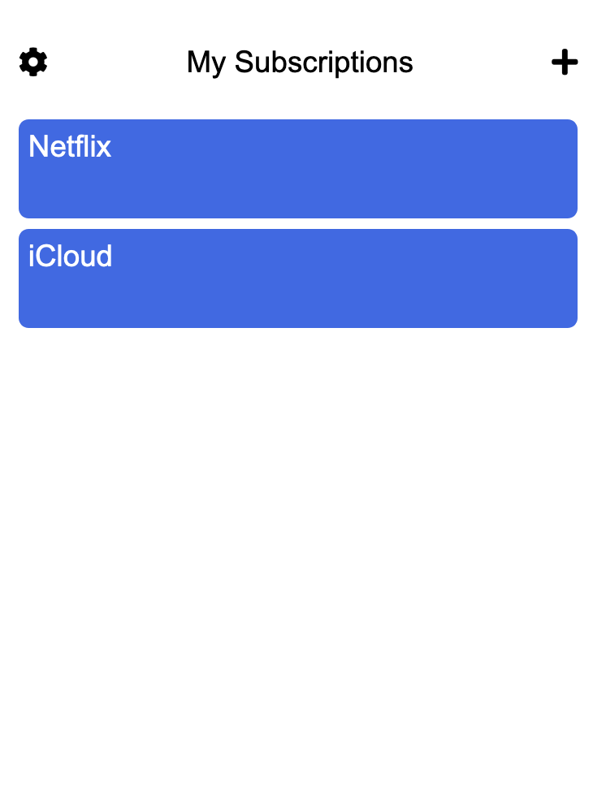

# Time
Open-source cross-platform application for subscription management. Save time. For free.

## Setup

1. Execute `npm i`.
2. Run `npm start`.
3. Go to server address. Usually `http://127.0.0.1:8080`.